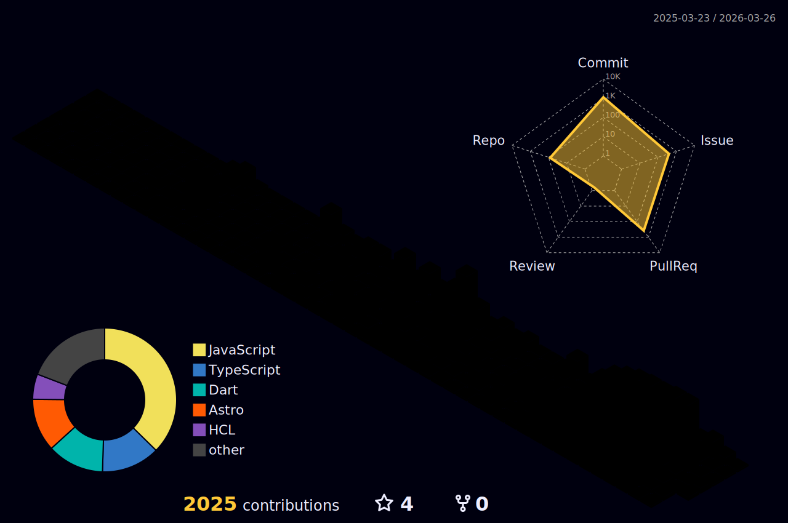

  

# sAI sRUJAN

Aspiring Cloud & DevOps Engineer | Open-Source Contributor | Flutter Developer

> Learning how systems behave under failure, not just under ideal conditions.

## About Me
- 🎓 B.Tech in Information Technology (2024–2028)
- ☁️ Focused on **Cloud & DevOps engineering**
- 📜 **OCI Foundations Certified**
- 📱 Background in **cross-platform app development**
- 🧩 I learn by **building → breaking → fixing**

 

---

 

  
  
  
  
  

 

---

## Language and tools

  <!-- Core Systems, Cloud & DevOps -->
  
  
  
  
  
  
  
  
  
  
  
  
  
  
  
  
  
  
  
  
  
  
  
  
  

  <!-- Languages, Backend & Data -->
  
  
  
  
  
  
  
  
  
  
  
  
  
  
  
  
  
  
  
  
  
  
  
  
  

  <!-- Frontend, Deployment & Tools -->
  
  
  
  
  
  
  
  
  
  
  
  
  
  
  
  
  
  
  
  
  

 

## My Stats

  

---

  

  

